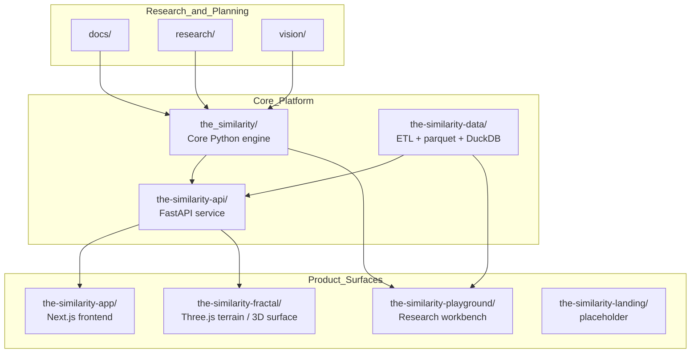
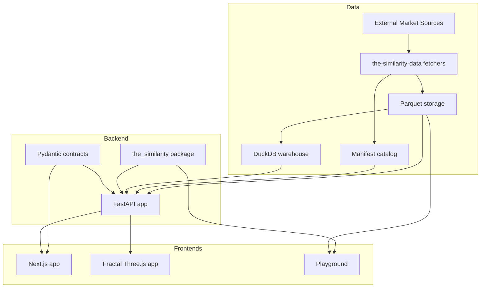

# The Similarity Architecture Overview

This is the canonical architecture document for the current repository layout.

If another document disagrees with this one about the live system structure,
trust this file first and treat older documents as historical notes unless they
explicitly say otherwise.

## Repo Shape

This repository is a monorepo with one central Python engine and several
surrounding product surfaces.

Top-level runtime areas:

- `the_similarity/`: core Python package and mathematical engine
- `the-similarity-api/`: FastAPI service layer over the engine
- `the-similarity-data/`: ingestion, parquet storage, manifest/catalog, DuckDB warehouse
- `the-similarity-app/`: main Next.js frontend
- `the-similarity-fractal/`: Three.js terrain / 3D world surface
- `the-similarity-playground/`: research workbench and exploratory tooling
- `the-similarity-landing/`: placeholder directory, currently not an active app

Supporting areas:

- `docs/`: documentation
- `research/`: research notes and method writeups
- `vision/`: long-range direction

## Core Architectural Idea

The repo is organized around one central engine:

1. the engine computes similarity, scoring, forecasting, and terrain-related logic
2. the API exposes that functionality over HTTP and WebSockets
3. the data subsystem provides datasets and warehouse queries
4. the frontends present different product surfaces over the same backend/core

The repo is therefore not a collection of unrelated apps. It is one platform
with multiple interfaces.

## Technology Stack

### Core Engine

- Python 3.11+
- Poetry
- NumPy
- pandas
- SciPy
- Pydantic
- matplotlib
- `dtaidistance`
- `EMD-signal`
- `PyWavelets`
- optional TDA support via `ripser` and `persim`

### API / Service Layer

- FastAPI
- Uvicorn
- Pydantic contracts from `the_similarity/contracts/api.py`
- REST + WebSocket endpoints

### Data Platform

- Python
- pandas
- PyArrow / parquet
- DuckDB
- `ccxt`
- `yfinance`
- `requests`

### Main Frontend

- Next.js 16
- React 19
- TypeScript
- Zod
- `lightweight-charts`
- Vitest

### Fractal / 3D Surface

- Three.js
- static HTML/CSS/JavaScript
- backend-powered terrain generation in engine mode

### Playground

- Python
- Plotly
- Jupyter / notebooks
- local wrappers over the core engine and data bank

## Component Responsibilities

### `the_similarity/`

This is the core computation package.

Main responsibilities:

- data loading
- normalization
- window generation
- tiered similarity search
- multi-method scoring
- forecasting / projection
- ensemble forecasting
- backtesting
- explainability
- strategy and portfolio utilities
- terrain generation and terrain parameterization
- shared API contracts

Important modules:

- `api.py`: public package API
- `core/matcher.py`: tiered search orchestrator
- `core/scorer.py`: confidence score aggregation
- `core/projector.py`: projection logic
- `core/ensemble.py`: blended forecasting
- `methods/`: independent mathematical methods
- `contracts/api.py`: canonical API schema models

### `the-similarity-api/`

This is the backend service layer.

Main responsibilities:

- HTTP and WebSocket entrypoints
- request validation
- request-to-engine orchestration
- dataset and OHLC serving
- dashboard payloads
- warehouse access
- auth and alerts
- terrain generation endpoints

Important modules:

- `app/main.py`: FastAPI entrypoint
- `app/services.py`: search/dashboard orchestration
- `app/data_service.py`: parquet/catalog loading and filtering
- `app/streaming.py`: WebSocket handlers
- `app/settings.py`: service config and CORS

### `the-similarity-data/`

This is the data platform.

Main responsibilities:

- fetch external datasets
- normalize and upsert parquet data
- maintain manifest/catalog metadata
- expose a DuckDB warehouse over parquet files
- run quality, freshness, and coverage checks

Important modules:

- `the_similarity_data/refresh.py`
- `the_similarity_data/storage.py`
- `the_similarity_data/manifest.py`
- `the_similarity_data/fetchers/*`
- `the_similarity_data/warehouse.py`

### `the-similarity-app/`

This is the main web application.

Main responsibilities:

- terminal-style search UX
- dashboard/search/strategy/portfolio views
- API consumption and schema validation
- charting and match visualization
- fallback mock payloads when API is absent

Important areas:

- `app/`: route entrypoints
- `components/terminal/`: terminal UI shell
- `components/dashboard/`: dashboard panels
- `components/search/`: search workstation UI
- `lib/api.ts`: API client adapter
- `lib/schemas.ts`: frontend schema validation

### `the-similarity-fractal/`

This is the terrain and 3D world surface.

Main responsibilities:

- local procedural terrain generation
- API-backed terrain rendering
- Three.js scene / lighting / camera / controls
- FPS exploration
- world snapshot persistence
- future 3D simulation entrypoint

Important files:

- `index.html`
- `src/app.js`
- `src/fractal.js`
- `src/terrain-renderer.js`
- `3d_sim_plan.md`

### `the-similarity-playground/`

This is the experimentation surface.

Main responsibilities:

- exploratory local runs against real datasets
- notebook-friendly engine wrappers
- charting and backtesting helpers
- local-vs-API comparison workflows

Important files:

- `playground.py`
- `notebooks/`

## Runtime Relationships

### Box-and-Arrow View



### Service Flow



## Search Pipeline

The core engine is organized as a tiered matching and projection pipeline.

```mermaid
flowchart LR
    L[load()] --> N[normalize()]
    N --> W[sliding windows]
    W --> P[Prefilter<br/>SAX / MASS / candidate pruning]
    P --> T1[Tier 1 scoring<br/>DTW + Pearson]
    T1 --> T2[Tier 2 enrichment<br/>Koopman / Wavelet / EMD / TDA / TE / Bempedelis]
    T2 --> C[compute confidence]
    C --> S[search results]
    S --> PR[project / ensemble_project]
    PR --> F[forecast curves / paths / intervals]
```

Main code path:

- `the_similarity/api.py`
- `the_similarity/core/matcher.py`
- `the_similarity/core/scorer.py`
- `the_similarity/core/projector.py`
- `the_similarity/core/ensemble.py`

## Terrain / Fractal Stack

The terrain stack is a parallel subsystem that now sits partly inside the core
engine and partly inside the fractal frontend.

```mermaid
flowchart TB
    subgraph Fractal_UI
        INDEX[index.html]
        APPJS[src/app.js]
        CLASSIC[src/fractal.js]
        RENDER[src/terrain-renderer.js]
    end

    subgraph API_Backend
        TERRAIN_EP[/terrain/generate]
        TGEN[core/terrain_generator.py]
        TPARAM[core/terrain_params.py]
        EROSION[core/erosion.py]
        SCATTER[core/feature_scatter.py]
    end

    INDEX --> APPJS
    APPJS --> CLASSIC
    APPJS --> RENDER

    APPJS -->|engine mode| TERRAIN_EP
    TERRAIN_EP --> TGEN
    TGEN --> TPARAM
    TGEN --> EROSION
    TGEN --> SCATTER
    TERRAIN_EP -->|heightmap/biome/features| RENDER
```

## Repo Organization Assessment

The current layout is usable, but not ideal.

What is already good:

- major product boundaries are real
- core engine, API, data, and frontends are separate
- research and docs are clearly outside runtime code

What is still imperfect:

- naming is inconsistent (`the_similarity` vs `the-similarity-*`)
- the backend concept is split across the core package, API service, and data layer
- `the-similarity-landing/` exists but is not an active app
- some older docs describe earlier system states

Recommended conceptual labels for charts:

- `the_similarity`: Core Similarity Engine
- `the-similarity-api`: Backend API Service
- `the-similarity-data`: Data Platform / Warehouse
- `the-similarity-app`: Main Web Application
- `the-similarity-fractal`: 3D Terrain / Simulation Surface
- `the-similarity-playground`: Research Playground
- `the-similarity-landing`: Landing Surface (Placeholder)

## Current Documentation Rules

Use these docs by purpose:

- `docs/architecture/ARCHITECTURE_OVERVIEW.md`: current canonical repo architecture
- `docs/architecture/ARCHITECTURE.md`: architectural principles and module design rules
- `docs/architecture/march_architecture.md`: historical architecture snapshot from an earlier stage
- `docs/reference/API_REFERENCE.md`: public API usage reference
- `docs/planning/plan.md`: historical implementation plan and status narrative
- `docs/planning/TODOS.md`: deferred tasks
